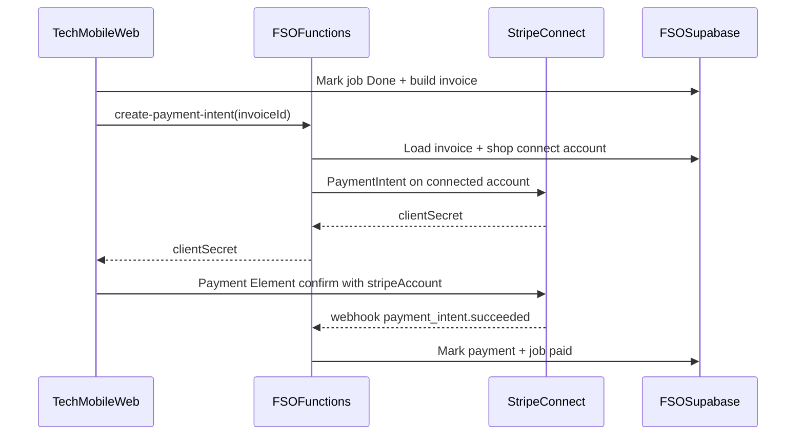

# Field Service Ops MVP - Plan

## Goal Capsule

- **Objective:** Ship a multi-tenant field-service product (new independent brand, name TBD) so a plumbing/HVAC/electrical shop can Book → Dispatch → Job → collect payment on-site via tech mobile web — dogfooded as shop #1 and sellable to other shops as simpler + cheaper than ServiceTitan/Jobber.
- **Product authority:** This plan owns the v1 pay-closed core loop only. Broader ServiceTitan-parity modules and polished marketing site packaging are not active scope. Product Contract R/A/F/AE IDs are authoritative for behavior; Planning Contract KTDs are authoritative for how.
- **Product Contract preservation:** unchanged (planning resolved deferred Q3–Q6 into KTDs; Q1–Q2 remain deferred non-blocking).
- **Open blockers:** None.
- **Stop conditions:** Do not reverse-engineer or copy ServiceTitan proprietary UI/APIs; do not ship memberships, marketing automation, payroll, QuickBooks sync, inventory/POs, native apps, or fleet/GPS in this plan; do not present fabricated property intelligence as live; do not host this product under the DeedScout brand or `deedscout.app` primary hostname.
- **Execution profile:** Schema and tenancy RLS test-first; feature units with enumerated scenarios below; manual phone-browser smoke for tech pay path.
- **Tail ownership:** Implementer applies Supabase migrations, creates the Netlify site + Stripe Connect platform settings, issues an SPI shop key for dogfood, and deploys the FSO Netlify site (separate from DeedScout).

## Product Contract

### Summary

A new-brand, multi-tenant ops app for home-services shops. v1 is a thin office (CSR booking, online request queue, dispatch board, simple pricebook) plus a strong tech mobile-web finish that invoices and collects card/ACH on-site. Florida property briefing is an optional job add-on, not the primary pitch.

### Problem Frame

Home-services shops need the money loop — book the call, put a tech on it, finish the job, get paid — without buying an enterprise suite. The builder wants to sell that product; running their own shop on it is the dogfood path. Existing DeedScout property/permit signals can enrich a job later, but are not the reason a contractor buys day one.

### Key Decisions

- **Dogfood + sell on one multi-tenant system** `(session-settled: user-directed — chosen over single-shop-first or white-label-later: sell the same system you run)` — Governs R1, R2.
- **Pay-closed core loop (Approach A)** `(session-settled: user-directed — chosen over office-first ServiceTitan-lite or briefing-led: matches simpler + cheaper)` — Governs R3–R12.
- **Primary wedge: simpler + cheaper; hero proof: on-site pay; add-on: FL property briefing** `(session-settled: user-approved — chosen over treating all three as co-primary: clear pitch and build order)` — Governs R12, R15.
- **Tech field UX is mobile web, not native** `(session-settled: user-directed — chosen over office-only updates or native apps)` — Governs R8.
- **On-site card/ACH collect before leave** `(session-settled: user-directed — chosen over invoice-only or customer remote pay as the v1 payment path)` — Governs R10, R11.
- **Booking = CSR form + customer online request (office confirms)** `(session-settled: user-directed — chosen over CSR-only or full self-scheduling)` — Governs R4, R5.
- **Multi-trade from day one (plumbing, HVAC, electrical)** `(session-settled: user-directed — chosen over plumbing-only or your-shop-trade-only)` — Governs R3.
- **New independent brand, not DeedScout-branded** `(session-settled: user-directed — chosen over DeedScout module or decide-later for positioning)` — Governs R1.
- **Independent product, not a ServiceTitan clone** — workflows inspired by the category; UX and data model are original — Governs all Rs.

<!-- ce-section: work-relationships -->
### How This Work Fits Together

This plan owns the **Field Service Ops v1 pay-closed core**. The broader “ServiceTitan-category” breakdown below is the current understanding, not a committed roadmap.

- Field Service Ops v1 (this plan)
  - **Enables** selling to other shops and dogfooding shop #1
  - **Can proceed independently of** DeedScout marketing surfaces
- Florida property briefing on the job
  - **Depends on** job address + existing SPI API (`docs/plans/2026-08-15-001-feat-service-property-intelligence-api-plan.md`, live at DeedScout `/api/property`)
  - **Embeds as** inline panel via FSO server proxy (KTD8)
- Later FSM modules (memberships, marketing, payroll, accounting sync, inventory, native apps, fleet)
  - **Depends on** stable shop/customer/job/payment core from this plan
  - **Outside v1** by explicit product decision

### Actors

- A1. Shop owner (account admin, pricebook, sees payments)
- A2. CSR / office staff (books jobs, confirms online requests)
- A3. Dispatcher (assigns techs/time on the board)
- A4. Technician (mobile web: status, notes, invoice, collect pay)
- A5. Customer (submits online service request; receives service; may pay on-site)
- A6. Shop tenant boundary (isolation unit for all shop data)

### Requirements

**Tenancy and brand**

- R1. The product ships under a new independent brand (final public name may land after functional MVP).
- R2. Every shop is an isolated tenant: customers, jobs, users, pricebook rows, invoices, and payments for shop A are never visible to shop B.

**Jobs and trades**

- R3. A shop can create and manage jobs tagged as plumbing, HVAC, or electrical (same product for all three trades).
- R4. A CSR can create a customer (or select existing) and book a job with trade, problem description, service address, and preferred time window.
- R5. A customer can submit an online service request; the request appears in an office queue until a CSR confirms it into an unassigned job ready for dispatch or declines it.
- R6. A dispatcher can view a day board of unassigned and scheduled jobs and assign a technician plus time window.
- R7. A job supports a clear field lifecycle: at least En route, On site, and Done (plus unpaid-complete with balance due when payment is not collected).

**Tech mobile web**

- R8. A technician can open an assigned job on a phone browser, update status, add notes and photos, and complete the job without a native app.
- R9. Office users can also update job status and invoice details when the tech cannot.

**Invoice and payment**

- R10. Before leaving, the tech (or office) can build an invoice from simple pricebook line items and optional custom lines.
- R11. The tech can collect card or ACH payment on-site from the phone; successful collection marks the job paid (partial payment leaves a visible balance due).
- R12. Shop owner can see which jobs were paid today (and outstanding balances) without leaving the product.

**Pricebook**

- R13. Each shop maintains a basic pricebook (name, trade, price) sufficient to build invoices; advanced catalog/features are out of scope.

**Property briefing add-on**

- R14. When a job has a service address and briefing data is available, users can open an optional Florida property briefing on the job with honest Live/Cached/unavailable labels; missing data must not be invented.
- R15. The product pitch and primary navigation treat property briefing as optional upside, not the core workflow.

**Admin**

- R16. Shop owner can invite users and assign roles among owner, CSR, dispatcher, and technician (a person may hold more than one role).

### Key Flows

- F1. CSR books a job
  - **Trigger:** Phone/walk-in customer needs service.
  - **Actors:** A2, A5, A6
  - **Steps:** Find/create customer → create job (trade, issue, address, window) → job appears for dispatch.
  - **Outcome:** Job is ready to assign.
  - **Covered by:** R3, R4, R2

- F2. Online request → confirmed job
  - **Trigger:** Customer submits web request.
  - **Actors:** A5, A2
  - **Steps:** Request enters queue → CSR confirms schedule or declines → confirmed request becomes a job.
  - **Outcome:** No unattended public self-scheduling; office stays in control.
  - **Covered by:** R5

- F3. Dispatch assignment
  - **Trigger:** Jobs need techs for the day.
  - **Actors:** A3, A4
  - **Steps:** Open board → assign tech + window → tech sees job on mobile web.
  - **Outcome:** Tech knows where to go and when.
  - **Covered by:** R6, R8

- F4. Field complete + get paid
  - **Trigger:** Tech finishes work on site.
  - **Actors:** A4, A5, A1
  - **Steps:** Status to Done → build invoice from pricebook → collect card/ACH on phone → job paid (or balance due) → owner sees payment on today’s list.
  - **Outcome:** Money collected before the truck leaves when payment succeeds.
  - **Covered by:** R7–R13

- F5. Optional property briefing
  - **Trigger:** Tech or office wants address context before/during the job.
  - **Actors:** A4, A2, A3
  - **Steps:** Open briefing from job → read labeled fields → continue job workflow.
  - **Outcome:** Extra context without blocking book/dispatch/pay.
  - **Covered by:** R14, R15

- F6. Second shop signup
  - **Trigger:** Another contractor creates an account.
  - **Actors:** A1 (new shop), A6
  - **Steps:** Create shop tenant → invite users → use same loops on empty isolated data.
  - **Outcome:** Sellable multi-tenant behavior proven beyond dogfood.
  - **Covered by:** R1, R2, R16

### Acceptance Examples

- AE1. Cross-tenant isolation
  - **Covers:** R2
  - **Given:** Shop A has customer “Rivera” and a paid job; Shop B is a separate tenant.
  - **When:** Shop B user searches customers or jobs.
  - **Then:** Rivera and Shop A’s job/payment never appear.

- AE2. Online request requires office confirm
  - **Covers:** R5
  - **Given:** Customer submitted an online request for HVAC no-cool.
  - **When:** No CSR has confirmed it.
  - **Then:** It is not a dispatched scheduled job; it remains in the request queue until confirmed or declined.

- AE3. On-site pay success
  - **Covers:** R10, R11, R12
  - **Given:** Tech has completed work and built an invoice with pricebook lines.
  - **When:** Card/ACH collection succeeds on the phone.
  - **Then:** Job shows paid; owner’s today view includes that payment.

- AE4. Unpaid completion visible
  - **Covers:** R7, R11
  - **Given:** Tech marks Done but payment fails or is skipped.
  - **When:** Owner or CSR opens the job.
  - **Then:** Balance due is visible; job is not treated as fully paid.

- AE5. Honest briefing gaps
  - **Covers:** R14
  - **Given:** Job address has parcel data but no permit cache.
  - **When:** User opens property briefing.
  - **Then:** Parcel fields show with trust labels; permit history is unavailable/Coming Soon — not invented.

### Success Criteria

- SC1. Dogfood shop can run a real call through book → dispatch → tech mobile complete → on-site pay without spreadsheets.
- SC2. A second shop account can run the same loop on isolated data.
- SC3. A contractor demo can complete “job → paid” on a phone browser in one continuous path.
- SC4. Pitch and UI hierarchy lead with simpler ops + get paid; property briefing is discoverable but not required to finish a job.

### Scope Boundaries

**In scope (v1)**

- Multi-tenant shops; roles; CSR booking; online request queue; dispatch board; job lifecycle; simple pricebook; invoices; on-site card/ACH; tech mobile web; optional FL property briefing on the job.

**Deferred for later**

- Memberships / service agreements
- Marketing campaigns / reputation tools
- Payroll / wage time tracking
- QuickBooks / full accounting sync
- Inventory, parts trucks, purchase orders
- Native iOS/Android apps
- Fleet / GPS tracking
- Full customer self-scheduling
- Rich estimates/proposals suite beyond invoice line items
- Enterprise ServiceTitan feature parity
- Stripe Terminal / hardware card readers
- Public brand marketing site polish and final pricing pages

**Outside this product's identity**

- Reverse-engineering or copying ServiceTitan proprietary clients, APIs, or trade dress
- Presenting demo/sample property data as live intel
- Shipping as a DeedScout-branded module on `deedscout.app`

### Dependencies / Assumptions

- Payments use Stripe Connect Express with Payment Element on mobile web (no hardware reader in v1).
- Florida property briefing calls existing DeedScout `GET /api/property` (SPI); core loop works when briefing is unavailable or unconfigured.
- “Simpler + cheaper” is positioning; exact public price and plan tiers are not fixed in this contract.
- Working title in-repo is `field-service-ops` / “Field Service Ops” until the public brand name is chosen.
- FSO uses its **own** Supabase project and **own** Netlify site (separate from DeedScout).

### Outstanding Questions

**Resolve Before Planning**

- None.

**Deferred (non-blocking)**

- Q1. Final public brand name and domain.
- Q2. List price / packaging tiers for “cheaper.”

**Resolved in Planning**

- Q3. Stripe Connect Express + Payment Element; no Terminal hardware in v1 — KTD5, KTD6.
- Q4. New `field-service-ops/` Vite + React + TS + Supabase app; separate Netlify site — KTD1.
- Q5. Inline briefing panel via FSO proxy to SPI — KTD8.
- Q6. Invoices only; no separate estimate document type — KTD7.

### Sources / Research

- DeedScout auth/Stripe patterns: `tax-deeds.html` (`FTDR_CONFIG`), `netlify/functions/_lib/{config,auth,stripe-sync}.js`, `SETUP.md`
- SPI live API: `netlify/functions/property-briefing.js`, `_lib/shop-auth.js`, `_lib/spi-*.js`, plan `docs/plans/2026-08-15-001-feat-service-property-intelligence-api-plan.md`
- Closest SPA scaffold: `app/` (Vite + React + TS + `@supabase/supabase-js`)
- Monorepo app convention: kebab-case top-level folders (`PROJECTS.md`)
- Session grounding: `/tmp/fso-grounding.md`

## Planning Contract

### Key Technical Decisions

- KTD1. **New top-level Vite + React + TypeScript SPA** at `field-service-ops/` with React Router, own `package.json`, own Netlify site publishing `dist/` — not Next.js, not under `deedscout.app`. Governs R1.
- KTD2. **Dedicated Supabase project for FSO** (auth + Postgres + Storage for job photos) with `shop_id` on every tenant table and RLS enforcing membership. Do not reuse DeedScout `profiles` / Pro subscription schema. Governs R2, R16.
- KTD3. **Roles as membership flags on `shop_members`** (`is_owner`, `is_csr`, `is_dispatcher`, `is_tech`) so one user can hold multiple roles. Governs R16.
- KTD4. **Public online request is unauthenticated, shop-scoped by public slug** (`/r/:shopSlug`); resolve slug→shop server-side (RPC or Netlify function) — never trust client `shop_id`; CSR confirm/decline is authenticated; rate-limit public creates. Governs R5, F2, AE2.
- KTD5. **Stripe Connect Express** for each shop; platform creates PaymentIntents on the connected account so payouts go to the shop. Governs R11, F4.
- KTD6. **On-site collect via Stripe Payment Element** (card + US bank/ACH when enabled) in the tech mobile web UI — not Stripe Terminal hardware in v1. Governs R8, R11, AE3.
- KTD7. **No separate estimate entity in v1** — pricebook lines + custom lines on the invoice only. Governs R10, R13.
- KTD8. **SPI as inline job panel** — FSO Netlify function (JWT + shop membership required) proxies to `https://deedscout.app/api/property` with a per-shop SPI API key stored server-side only (AES-GCM ciphertext in a service-role-only column/store; never selected by member RLS); UI renders trust-labeled groups; core job flow never blocks on SPI failure. Governs R14, R15, AE5, F5.
- KTD9. **Working UI brand string “Field Service Ops”** (replaceable) until Q1 brand name lands — no DeedScout chrome. Governs R1, R15.
- KTD10. **Photo uploads via private Supabase Storage** scoped by `shop_id/job_id/` with RLS, signed URLs for display, size/MIME limits; notes as text rows. Governs R8.

### High-Level Technical Design

```text
Browser (office + tech mobile web)
  |  Supabase Auth JWT
  v
Supabase (FSO project): shops, members, customers, service_requests,
  jobs, pricebook_items, invoices, payments, storage
  ^
  | service role / Stripe webhook
FSO Netlify functions
  - create-connect-account / account-link (owner-only)
  - create-payment-intent (direct charge on connected account)
  - stripe-connect-webhook (Connect events; metadata shop_id + invoice_id)
  - create-public-request (optional; or SECURITY DEFINER RPC)
  - property-briefing-proxy (JWT + membership) -> DeedScout GET /api/property + X-Api-Key
```



Online intake lives in `service_requests` (`pending|confirmed|declined`). Job statuses: `unassigned` → `scheduled` → `en_route` → `on_site` → `done` with `payment_status` in `unpaid | partial | processing | paid` (ACH may sit in `processing` until settled).

### Assumptions

- Stripe Connect platform account can be created for the new brand; Express onboarding is acceptable for v1 shops.
- DeedScout SPI remains deployed and reachable; dogfood shop gets an SPI key via existing `scripts/issue-shop-api-key.mjs`.
- ACH may take days to settle; UI may show `processing` then `paid` via webhook — card is the happy-path demo.
- Separate Netlify site DNS can start on `*.netlify.app` until Q1 domain exists.

### Implementation Constraints

- Do not add Vercel config or deploy FSO to Vercel.
- Do not put FSO primary UX on `deedscout.app` or reuse DeedScout marketing chrome.
- Keep SPI honesty: never invent Live/Cached fields in the proxy or UI.
- Prefer patterns from `app/` (Vite+React+TS+Supabase client) and CommonJS Netlify functions style from `netlify/functions/` (FSO functions live under `field-service-ops/netlify/functions` with `"type": "commonjs"`).
- No ServiceTitan API/UI cloning.

### Sequencing

1. U1 scaffold + Netlify shell (unblocks local UI)
2. U2 tenancy schema + auth/roles (unblocks all data)
3. U3 book path (customers, CSR jobs, online requests)
4. U4 dispatch + tech job mobile lifecycle + photos
5. U5 pricebook + invoices + Stripe Connect pay
6. U6 SPI inline panel + ops docs

### Research Inputs

- `app/package.json`, `app/` Vite+Supabase SPA layout
- `netlify/functions/_lib/config.js`, `stripe-webhook.js`, `create-checkout-session.js`
- `netlify/functions/property-briefing.js`, `_lib/shop-auth.js`
- `supabase/schema.sql` (DeedScout — pattern reference only, do not merge FSO tables into it)
- `PROJECTS.md` folder convention

### Alternatives Considered

- **Next.js app** — stronger SSR/marketing later; rejected for v1 to match existing Vite+Supabase SPA skill and keep the mobile-web app thin.
- **Host on deedscout.app first** — faster shared deploy; rejected to keep new-brand isolation (R1).
- **Platform-charges-then-payouts (no Connect)** — simpler Stripe; rejected because shops must receive on-site funds (R11 sell story).
- **SPI link-out only** — less build; rejected in favor of inline panel for the Florida add-on (still optional, non-blocking).

## Implementation Units

### U1. App scaffold and Netlify shell

- **Goal:** Runnable `field-service-ops` Vite+React+TS app with working-title shell, router placeholders, and Netlify build/publish config for a separate site.
- **Requirements:** R1, R15, KTD1, KTD9
- **Files:** `field-service-ops/package.json`, `field-service-ops/vite.config.ts`, `field-service-ops/index.html`, `field-service-ops/src/main.tsx`, `field-service-ops/src/App.tsx`, `field-service-ops/src/styles.css`, `field-service-ops/netlify.toml`, `field-service-ops/README.md`, `PROJECTS.md` (one-line entry)
- **Approach:** Clone structure/spirit of `app/` (Vite React TS + react-router). Routes placeholders: `/login`, `/app` (office), `/tech`, `/r/:shopSlug` (public request). Brand string “Field Service Ops”. Netlify: `publish = dist`, `functions = netlify/functions`, SPA `/* → /index.html` **after** `/api/*` redirects to `/.netlify/functions/*` for `create-connect-account`, `create-payment-intent`, `stripe-connect-webhook`, `property-briefing-proxy`, and public-request if used (mirror root DeedScout `netlify.toml` pattern). README: `npm install && npm run dev` and local URL.
- **Dependencies:** None
- **Test scenarios:**
  - `npm run typecheck` / build succeeds
  - Dev server serves shell with brand visible without DeedScout chrome
  - Unknown authenticated routes do not 404 the SPA (Netlify/history fallback documented)
- **Verification:** `cd field-service-ops && npm install && npm run build`

### U2. Multi-tenant schema, auth, and roles

- **Goal:** Shops, memberships, RLS isolation, signup creates shop #N, invites assign roles.
- **Requirements:** R2, R16, F6, KTD2, KTD3
- **Files:** `field-service-ops/supabase/migrations/20260912_fso_tenancy.sql`, `field-service-ops/supabase/schema.sql`, `field-service-ops/src/lib/supabase.ts`, `field-service-ops/src/auth/*`, `field-service-ops/src/pages/Login.tsx`, `field-service-ops/src/pages/Team.tsx`, `field-service-ops/tests/tenancy.test.ts` (or `*.test.ts` colocated)
- **Approach:** Tables: `shops` (id, name, slug unique, stripe_connect_account_id nullable, timestamps — **no** SPI secret column readable by members). SPI secrets: service-role-only store (AES-GCM ciphertext table/column with no authenticated SELECT, or equivalent); owner writes via Netlify function only. `shop_members` (shop_id, user_id, role flags, unique shop+user). Default RLS: select/write when `auth.uid()` is an active member of `shop_id`. **Bootstrap:** `SECURITY DEFINER` RPC `create_shop_with_owner(name, slug)` (or auth trigger) inserts shop + owner membership in one privileged transaction — clients do not direct-insert shops under membership RLS. **Invites (v1):** password/set-password invite via Admin API Netlify function (defer magic-link-only). Never join across shops without membership check.
- **Dependencies:** U1
- **Test scenarios:**
  - Member of shop B cannot read shop A’s `shops`/`shop_members` rows
  - `create_shop_with_owner` succeeds for a newly signed-up user with no prior membership
  - Owner can invite a tech; tech cannot invite owners (authorization rules)
  - User with CSR+tech flags can access both office book and tech routes
  - Unauthenticated access to `/app` redirects to login
  - Member SELECT on shops never returns SPI secret material
- **Verification:** Migration applies on FSO Supabase; Vitest/node tests for policy helpers and/or documented SQL policy assertions

### U3. Customers, CSR booking, and online requests

- **Goal:** Complete F1/F2 book path with trade tags and office-controlled online requests.
- **Requirements:** R3, R4, R5, F1, F2, AE1, AE2, KTD4
- **Files:** `field-service-ops/supabase/migrations/20260912_fso_customers_jobs.sql` (or extend tenancy migration), `field-service-ops/src/pages/Customers.tsx`, `field-service-ops/src/pages/BookJob.tsx`, `field-service-ops/src/pages/RequestQueue.tsx`, `field-service-ops/src/pages/PublicRequest.tsx`, `field-service-ops/netlify/functions/create-public-request.js` (if not using RPC only), `field-service-ops/tests/booking.test.ts`
- **Approach:** `customers` (shop_id, name, phone, email, address fields). `service_requests` (shop_id, status `pending|confirmed|declined`, trade, description, contact, address, preferred_window). `jobs` created on CSR book or on confirm (trade enum plumbing/hvac/electrical, status `unassigned`, customer_id, address, window). **Public path:** `/r/:shopSlug` must not accept client-supplied `shop_id` — resolve slug→shop in a `SECURITY DEFINER` RPC or Netlify function and INSERT with that resolved id; deny anon SELECT/UPDATE/DELETE on `service_requests`. Add per-slug + IP rate limit (429) and field length validation on public create. Confirm copies into `jobs` as `unassigned` and marks request confirmed.
- **Dependencies:** U2
- **Test scenarios:**
  - CSR creates customer + job → job `unassigned` with trade
  - AE2: public submit creates pending request, no job row until confirm
  - AE1: member of shop B cannot read shop A customers/jobs
  - Confirm creates unassigned job; decline leaves no job
  - Invalid shop slug → friendly 404 on public form
  - Public forge of another shop’s UUID as shop_id is rejected
  - Rate-limit exceeded → 429
- **Verification:** Unit/integration tests with mocked Supabase or local test project

### U4. Dispatch board and tech job mobile lifecycle

- **Goal:** Assign techs/windows; tech mobile web runs en route → on site → done with notes/photos; office can update too.
- **Requirements:** R6, R7, R8, R9, F3, KTD10
- **Files:** `field-service-ops/src/pages/DispatchBoard.tsx`, `field-service-ops/src/pages/TechJobList.tsx`, `field-service-ops/src/pages/TechJobDetail.tsx`, `field-service-ops/src/components/JobStatusControls.tsx`, Storage policies in migration, `field-service-ops/tests/dispatch-tech.test.ts`
- **Approach:** Day board lists unassigned + scheduled for selected date; assign `tech_user_id` + window → status `scheduled`. Tech list filters jobs assigned to current user. Status transitions enforce order loosely (allow office override for **status** — R9 status half). Notes table; photos to **private** Storage bucket under `shop_id/job_id/` with RLS, signed URLs for display, size/MIME allowlist. Mobile-first CSS for `/tech` routes. Unpaid completion allowed (payment_status stays unpaid) — pairs with U5.
- **Dependencies:** U3
- **Test scenarios:**
  - Assign tech → job appears on that tech’s list only
  - Status path en_route → on_site → done
  - Office can set status on same job
  - Photo upload path rejects cross-shop object keys; unauthenticated object GET fails
  - Unassigned jobs do not appear on tech list
- **Verification:** Component/hook tests + manual phone-width check locally

### U5. Pricebook, invoices, and Stripe Connect on-site pay

- **Goal:** Build invoices from pricebook; tech collects card/ACH on-site; owner sees today’s payments; unpaid balance visible.
- **Requirements:** R9, R10, R11, R12, R13, F4, AE3, AE4, KTD5, KTD6, KTD7
- **Files:** `field-service-ops/supabase/migrations/20260912_fso_billing.sql`, `field-service-ops/src/pages/Pricebook.tsx`, `field-service-ops/src/pages/TodayMoney.tsx`, `field-service-ops/src/components/InvoiceBuilder.tsx`, `field-service-ops/src/components/OnSitePay.tsx`, `field-service-ops/netlify/functions/package.json`, `field-service-ops/netlify/functions/create-connect-account.js`, `field-service-ops/netlify/functions/create-payment-intent.js`, `field-service-ops/netlify/functions/stripe-connect-webhook.js`, `field-service-ops/netlify/functions/_lib/stripe.js`, `field-service-ops/tests/payments.test.ts`
- **Approach:** `pricebook_items` (shop_id, name, trade, unit_amount_cents). `invoices` + `invoice_lines`. `payments` (amount, status, stripe_payment_intent_id). Owner-only Connect onboarding via Account Link (`is_owner` enforced server-side). `create-payment-intent` authenticates JWT, verifies membership + Connect account, creates **direct** PaymentIntent on the connected account (`stripeAccount`), stamps `metadata.shop_id` + `metadata.invoice_id`; Payment Element loads Stripe.js with `stripeAccount`. Webhook verifies signature, binds event to matching Connect account + metadata, marks payment succeeded/failed/processing and updates job `payment_status`. Office can build/edit invoice when tech cannot (R9 invoice half). TodayMoney aggregates paid/partial/processing for local day. Skip payment → AE4 balance due.
- **Dependencies:** U4
- **Test scenarios:**
  - Invoice totals from pricebook + custom line
  - AE3: succeeded webhook → job paid + appears on TodayMoney
  - AE4: done without pay → balance due visible
  - PaymentIntent rejected if shop has no Connect account
  - Tech JWT cannot start Connect onboarding (403)
  - Webhook with mismatched Connect account/metadata rejected
  - Partial payment leaves remaining balance
  - Cross-tenant cannot pay another shop’s invoice
- **Verification:** Function tests with mocked Stripe; webhook signature + binding tests; manual test mode card smoke after Connect Express test account

### U6. SPI inline briefing panel and ops docs

- **Goal:** Optional inline property briefing on the job via authenticated proxy; document dogfood ops for SPI key + Connect.
- **Requirements:** R14, R15, F5, AE5, KTD8
- **Files:** `field-service-ops/netlify/functions/property-briefing-proxy.js`, `field-service-ops/src/components/PropertyBriefingPanel.tsx`, `field-service-ops/src/pages/TechJobDetail.tsx` (integrate), office job detail integrate, `field-service-ops/tests/briefing-panel.test.ts`, `field-service-ops/README.md` (SPI key + Connect setup)
- **Approach:** Panel behind “Property briefing” disclosure (not primary nav). Proxy requires Supabase JWT + active membership for the job’s shop, loads SPI key via service role only, calls DeedScout `/api/property`, returns JSON; never returns the SPI key to the client. On error show unavailable without blocking job. Render group trust labels. Owner configures SPI key through a Netlify function write path. README covers env vars and dogfood checklist (SC1–SC3 remain Definition of Done / Verification manual smoke, not U6 pass criteria).
- **Dependencies:** U4 (job address); U5 not required for briefing
- **Test scenarios:**
  - AE5: mocked SPI partial response renders parcel + unavailable permits, no invented fields
  - Unauthenticated or cross-tenant proxy call → 401/403
  - SPI 401/500 → panel error/unavailable, job actions still enabled
  - Shop without SPI key → panel explains setup, no crash
  - Briefing control is secondary (not required to mark Done)
- **Verification:** Proxy unit tests with mocked fetch; UI tests for labels; README ops checklist

## Verification Contract

- **Install/build:** `cd field-service-ops && npm install && npm run build`
- **Unit/integration:** `cd field-service-ops && npm test` (add script; Vitest preferred for SPA + function helpers)
- **Tenancy:** Automated AE1-style RLS/membership tests must pass before calling multi-tenant done
- **Payments:** Mocked Stripe webhook + PaymentIntent tests; manual Stripe test-mode card on a phone browser after Connect Express test onboarding
- **SPI:** Mocked proxy/UI tests; optional live curl to DeedScout `/api/property` with dogfood key
- **Do not** require DeedScout Pro checkout or `deedscout.app` session cookies for FSO
- **Local preview:** Prefer `npm run dev` in `field-service-ops` (Vite); share clickable `http://localhost:5173/` (or configured port); if static preview needed, `npm run preview` after build

## Definition of Done

- U1–U6 complete with listed test scenarios passing (mocks acceptable for Stripe/SPI network).
- Product Contract R1–R16 satisfied for the pay-closed v1 loop.
- Two shops demonstrably isolated (AE1).
- Tech can complete job → invoice → test-mode on-site pay on mobile web (SC3).
- Property briefing optional, honest labels, non-blocking (AE5, SC4).
- No memberships/marketing/payroll/QB/inventory/native/fleet shipped.
- No ServiceTitan proprietary cloning; no DeedScout branding on FSO primary UI.
- `field-service-ops/README.md` covers env vars, Supabase migrate, Stripe Connect, SPI key, and local run URL.
- Implementation changes land on a `cursor/*-6606` branch with PR; plan artifact remains this file at `implementation-ready`.
